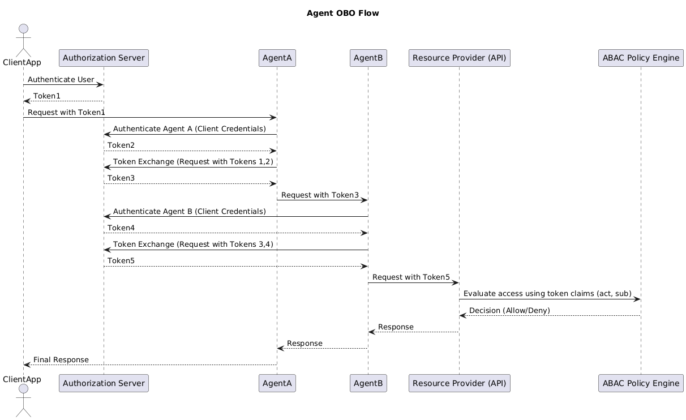
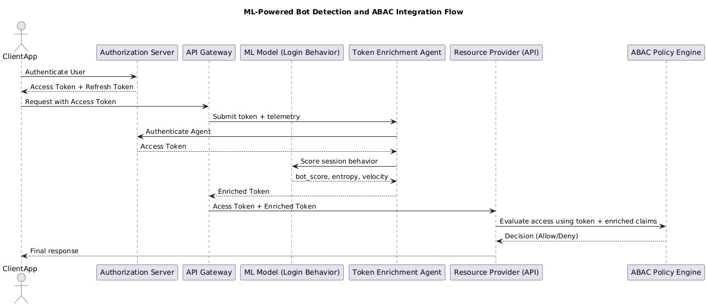

# AI Agents and Tenant/User Isolation

## Motivation

Autonomous agents are increasingly operating alongside traditional services - enriching identity tokens, interpreting behavioral telemetry and driving access decisions. 
However, they often interact with sensitive, user or tenant scoped data. Without strict identity and scope enforcement, agents risk bridging isolation boundaries by 
injecting claims or making decisions outside their authorized domain.

---

## The Core Risk: Excessive Agency

Per [OWASP LLM08 – Excessive Agency](https://genai.owasp.org/llmrisk2023-24/llm08-excessive-agency/), agents should never act beyond their authorized scope. 

In systems that rely on user delegated permissions to agent, this includes:
- Losing user context when making service to service calls
- Not verifying user context at each service boundary
- Making access decisions without intersecting agent and user scopes

In systems without user delegation, this includes:
- Optional agent authentication, leading to agents acting without proper identity
- Applying ML heuristics globally without regard for data isolation, e.g., tenant or user boundaries
- Making access decisions without considering agent scope

These behaviors constitute excessive agency — leading to cross-tenant leakage, unauthorized privilege escalation, and governance violations.

---

## Architectural Solution: Token-Based Identity, Tenant/User Claims Verification

### An agent that is authorized to access a user's resource should:
1. Authenticate via OAuth2
- Use client credentials flow to obtain a scoped access token, asserting the agent's identity.
- Possess the user's access token, asserting the user's identity and scope.
- Exchange the above tokens for a new token that includes both actor (agent) and subject (user) claims along with the delegated scope.
- Effect user consent (required) for the delegation, typically out of band (implementation specific).
2. Require user and tenant scoped enforcement at the Resource
- Validate agent and user scopes, roles.

### Token Exchange Issued Claims (example)
```
{
  "aud": "api://resource",
  "iss": "https://as.example.com",
  "exp": 1756457796,
  "nbf": 1756454196,
  "iat": 1756454196,
  "sub": "wIy3itAYUu5NsPeaXqZZj3CeUYnhY77fYS0w0KqYgaA",
  "name": "Admin TestUser",
  "tenant_id": "49636e46-3ba7-468d-904f-34b07f1eb62d",
  "unique_name": "admintestuser@sanketkaluskarhotmail.onmicrosoft.com",
  "upn": "admintestuser@sanketkaluskarhotmail.onmicrosoft.com"
  "roles": [
    "Admin"
  ],
  "act": {
    "sub": "agent92701",
    "client_id": "f1211c46-...",
    "app_name": "WebAgentService",
    "tenant_id": "49636e46-3ba7-468d-904f-34b07f1eb62d",
    "identitytype": "agent",
    "role": "ReviewAssistant"
  },
  "scope": "Files.Read.All",
  "client_id": "2a41fld7-..."
}
```

### Enforcement Policy (Pseudocode)
```
// Checks for "aud" and "iss" intentionally omitted for clarity
// JWT signature verification also omitted for clarity

allowed_agent_roles = ["ReviewAssistant", ...]
if identitytype == "agent":
    if actor.scope not in allowed_agent_roles:
        deny("Agent not authorized")
    elif actor.tenant_id != user.tenant_id:
        deny("Agent not authorized")
```
Checking agent tenant/domain matches the user's is defense in depth and so is checking that the agent has adequate permissions. 
The first line of defense is user (or admin) consent.

### Token Exchange
Also know as the On-Behalf-Of (OBO) flow, it is formalized via the [OAuth 2.0 Token Exchange RFC 8693](https://datatracker.ietf.org/doc/html/rfc8693).
- Azure AD supports OBO via a the [Azure AD On-Behalf-Of flow](https://learn.microsoft.com/en-us/entra/identity-platform/v2-oauth2-on-behalf-of-flow), 
although it does not support separated actor and subject claims. 
- Okta supports OBO via the [Okta On-Behalf-Of flow](https://developer.okta.com/docs/guides/set-up-token-exchange/main/), which does support separated actor and subject claims.
- Note that in a multi-hop OBO chain, each agent only sees:
  - The user identity, and 
  - The immediate caller's identity (the previous agent in the chain) - by design


### UML Sequence Diagram: Agent Delegated Access via OBO/Token Exchange


---

### An agent that operates without a user context should:
1. Be called by the API Gateway, before calling the Resource
2. Authenticate via OAuth2
- Use client credentials flow to obtain a scoped access token, asserting the agent's identity.
3. Produce an Enriched Token with claims based on agent input, such as:
- Entropy and Velocity scores from a ML model.
- Other agent-specific claims, such as risk scores or behavioral telemetry.
- The enriched token should include the access token, to bind the agent's identity to the enriched claims.
- The API Gateway passes the enriched token to the Resource (X-Enriched-JWT header), along with the original token (Authorization header).
4. Require user and tenant scoped enforcement at the Resource
- ABAC engine validates that the agent's tenant/domain matches the subject's.
- Validate agent and user scopes.
5. Log enrichment provenance
    - Tokens and claims must record which agent performed enrichment and under what scope.

### Resource Request with Enriched Token
```
POST /resource
Authorization: Bearer eyJhbGciOi...
X-Enriched-JWT: {
  "actorToken": "eyJhbGciOiJIUzI...",
  "bot_score_": 23,
  "entropy": "d4f8a2c9e1b7a6f3",
  "velocity": {
      "actionsPerMinute": 85,
      "avgLatencyMs": 40,
      "burstScore": 0.92
  }
}
```

### Enforcement Policy (Pseudocode)
```
// Checks for "aud" and "iss" intentionally omitted for clarity
// JWT signature verification also omitted for clarity

if actor.tenant_id != user.tenant_id or actor.scope != "agent.enrich":
    deny("Agent not authorized")
```
This ensures that enriched claims are only injected by agents explicitly scoped to the same tenant as the user.

### UML Sequence Diagram: Agent Access without User Context


---
